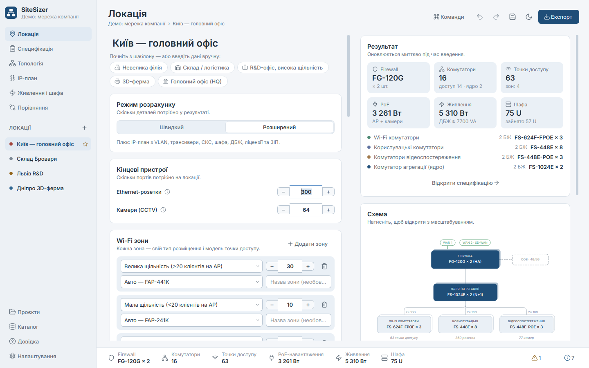
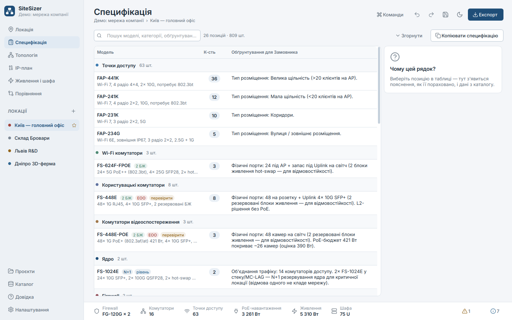
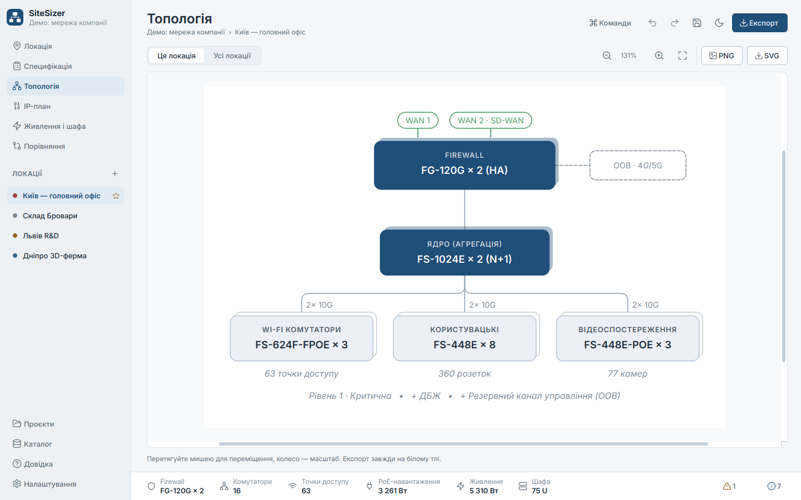
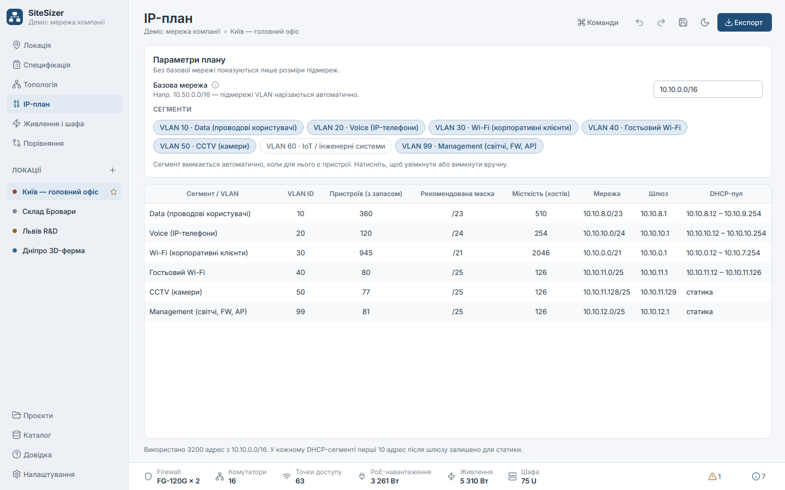
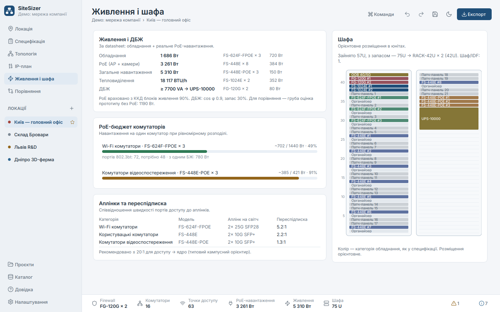
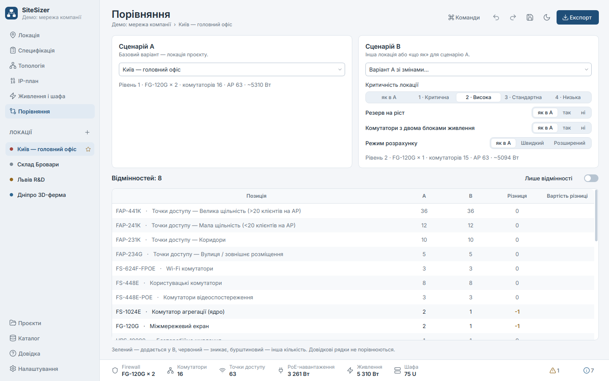
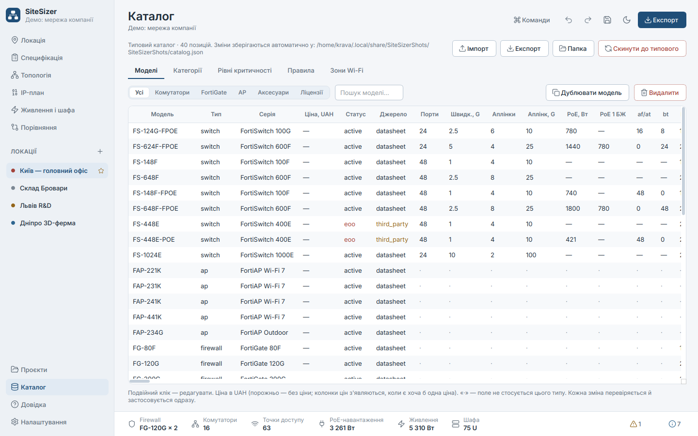
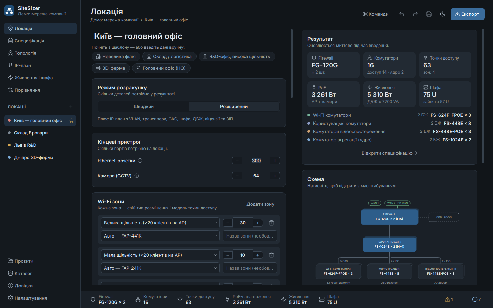
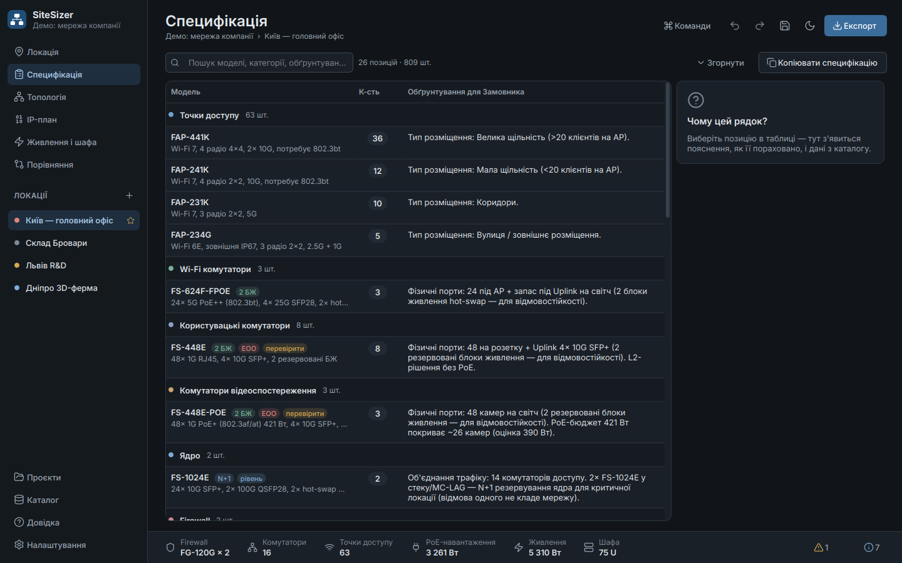

# SiteSizer — розрахунок мережевого обладнання для локацій

Desktop tool for sizing Fortinet equipment (FortiGate, FortiSwitch, FortiAP) for a company location. Enter a few
numbers — sockets, cameras, Wi-Fi zones, criticality — and instantly get a justified bill of materials, a clean
topology diagram, an IP/VLAN plan, power/PoE/rack estimates, and customer-ready Excel and PDF exports.

The UI is Ukrainian by default, with a full English version (Settings → Language).



## Швидкий старт (для колег)

1. Запустіть `SiteSizer.exe`.
2. Натисніть шаблон («Склад», «R&D-офіс», «HQ»…) або введіть кількість розеток, камер і зон Wi-Fi.
3. Оберіть рівень критичності — праворуч одразу видно, що він змінює.
4. **Експорт → Excel / PDF.** Готово.

`Ctrl+K` — палітра команд, `Ctrl+S` — зберегти проєкт, `F1` — довідка з поясненням логіки.

## Features

- **Live sizing** — every keystroke recalculates the BoM, diagram, IP plan, power and checks (no "Calculate" button).
- **Justified BoM** — every line has a customer-facing reason; the *Why this line?* panel shows how it was
  calculated, which rule or tier added it, and the catalog data behind it.
- **Criticality tiers 1–4** — firewall HA, N+1 core (MC-LAG), UPS, OOB, dual-PSU switches, dual uplinks, spares,
  FortiGuard/FortiCare level. All of these can be edited in the catalog.
- **Datasheet-verified catalog** — FortiLink and FortiAP limits, PoE budgets and 802.3bt port counts, power,
  throughput (see [docs/RESEARCH.md](docs/RESEARCH.md)). Edit it in the app, or import/export it as JSON.
- **Smart checks** — PoE budget (auto-adds switches), 802.3bt ports (auto-upgrades to FS-624F-FPOE), core
  port capacity, firewall switch/AP/throughput limits, oversubscription, 90 m copper limit → IDF closets,
  End-of-Order models, unverified data.
- **Extended mode** — VLAN plan carved from a base network (gateway + DHCP pool), transceivers/DAC, cabling,
  rack elevation and size, UPS sizing with the real PoE load, licences, spares, FortiManager/FortiAnalyzer.
- **Projects** — several locations in one file (HQ + remote sites), hub-and-spoke diagram, duplicate a location,
  compare scenarios side by side (e.g. Tier 2 vs Tier 1) with a cost diff when prices are set.
- **Exports** — Excel (BoM, IP plan, diagram, inputs), branded PDF report, PNG/SVG diagram, JSON/CSV, and
  copy-to-clipboard (pastes as a table into Excel, Word or Outlook). Heavy exports run in the background.
- **Comfortable to use** — light/dark themes (follows the system), UI scaling, undo/redo, keyboard-first input,
  command palette, a first-run tour, toasts, confirmations for destructive actions.

| | |
|---|---|
|  |  |
|  |  |
|  |  |
|  |  |

## Install & run from source (Windows, PowerShell)

Requires Python 3.11+ (developed on 3.14).

```powershell
py -3 -m venv .venv
.\.venv\Scripts\pip install -r requirements.txt
.\.venv\Scripts\python -m sitesizer          # GUI
.\.venv\Scripts\python -m sitesizer.cli      # console flow (same questions as the old script)
```

Open a project directly with `python -m sitesizer path\to\project.sizing.json`.

### Command line / automation

```powershell
# Interactive, like counter_location.py (writes BoM_<name>_<date>.xlsx):
python -m sitesizer.cli

# From JSON (a single location or a whole project), with exports:
python -m sitesizer.cli --json site.json --out result.json --xlsx BoM.xlsx --pdf Report.pdf
'{"name": "Склад", "sockets": 40, "cameras": 32, "tier": 4}' | python -m sitesizer.cli --json - --out -

# Reproduce the original prototype's assumptions (regression checks):
python -m sitesizer.cli --compat --json site.json
```

A site JSON uses the same fields as the GUI: `sockets`, `cameras`, `ap_groups` (`zone`, `qty`, optional `model`),
`tier`, `aggregation` (`auto`/`yes`/`no`, or the prototype's `y`/`n`/empty), `reserve`, `redundant_psu`,
`mode` (`quick`/`extended`), `fortios_version`, `inspected_mbps`, `max_cable_run_m`, `ip.base_network`, …

## Build the single-file .exe

```powershell
.\build.ps1            # creates .venv, runs tests, builds dist\SiteSizer.exe
.\build.ps1 -SkipTests
```

The build uses PyInstaller with `packaging/sitesizer.spec` (one file, windowed, app icon and Windows version info;
unused Qt modules are excluded). On Linux/macOS use `./build.sh`.

## Development

```powershell
pip install -r requirements-dev.txt
$env:QT_QPA_PLATFORM="offscreen"; python -m pytest      # 136 tests: engine, golden, IP, exporters, GUI smoke
ruff check sitesizer tests; ruff format sitesizer tests
mypy sitesizer
python tools\screenshots.py docs\screenshots            # regenerate screenshots (light + dark)
```

- [docs/ARCHITECTURE.md](docs/ARCHITECTURE.md) — modules, data flow, design system.
- [docs/CATALOG.md](docs/CATALOG.md) — how to edit models, tiers and rules.
- [docs/RESEARCH.md](docs/RESEARCH.md) — datasheet findings, discrepancies from the whiteboard notes, sources.

User data (catalog edits, settings, logs) lives in `%APPDATA%\SiteSizer\SiteSizer\`; the log rotates at 1 MB.

## Decisions made with the network engineer

| Question | Decision |
|---|---|
| Whiteboard "25х / 15х" | **2 PSU / 1 PSU.** Premium (dual hot-swap PSU) models are recommended for tiers 1–2, and the app asks you to confirm. The old quantity threshold is still available (`variant_mode: quantity`). |
| FS-448E family | **Kept as the dual-PSU models**: FS-448E (access) and FS-448E-POE (CCTV), as on the whiteboard. Third-party sources list them as End-of-Order 2026-09-13, so the app shows an info note to check availability; FS-648F / FS-648F-FPOE are in the catalog as alternatives. FS-448E-POE has only 421 W of PoE (~28 cameras at 15 W), so extra camera switches are added automatically when needed. |
| Not enough 802.3bt ports on FS-124G-FPOE | **Automatic upgrade** to FS-624F-FPOE, explained in the BoM line. |
| Currency | **UAH**; VAT and discount are optional. Prices are empty by default, so the price columns stay hidden. |
| FortiOS version | **Per-location input** (FG-120G manages 48 switches on FortiOS 7.6.1+, 32 on older versions). |

## Known limitations

- Some catalog values come from third-party sources only (FS-448E family, FS-1024E power) and are flagged
  🟡 in the app and in RESEARCH.md. Confirm them on support.fortinet.com before quoting.
- Each switch category uses one model for the whole site (no mixed FS-124G + FS-624F in the same category).
- PDF tables can break between pages in the middle of a long row.
- The Windows `.exe` has to be built on Windows (`build.ps1`). The PyInstaller spec was validated by building
  and launching a Linux binary.
