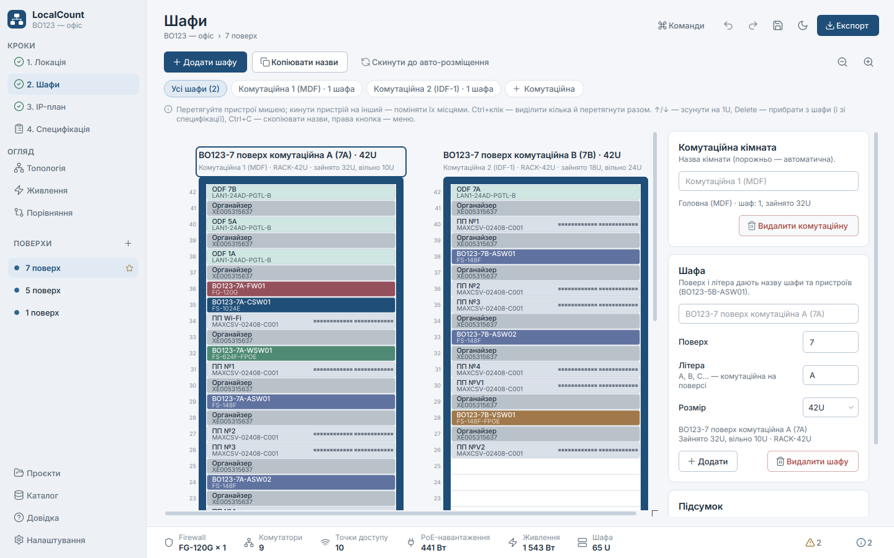
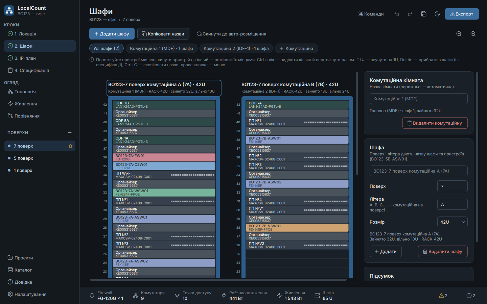

# LocalCount — розрахунок мережевого обладнання для локацій

Desktop tool for sizing Fortinet equipment (FortiGate, FortiSwitch, FortiAP) for a company location. Enter a few
numbers — sockets, cameras, Wi-Fi zones, criticality — and instantly get a justified bill of materials, a clean
topology diagram, an IP/VLAN plan, power/PoE/rack estimates, and customer-ready Excel and PDF exports.

The UI is Ukrainian by default, with a full English version (Settings → Language).


## Швидкий старт (для колег)

1. Запустіть `LocalCount.exe` (Windows) або `LocalCount.app` (Mac, див. нижче).
2. **Локація і поверхи:** проєкт — це одна локація, а кожен запис у боковій панелі «Поверхи» — поверх
   (`+` додає наступний). Код (напр. `BO123`), ID (другий октет, напр. `57` → `10.57.x.x`), рівень і IP-план
   спільні для всіх поверхів; на кожному поверсі — свої розетки, камери, зони Wi-Fi і шафи.
   **Фаєрвол один на локацію:** він рахується на комутатори всіх поверхів і стоїть на поверсі з перемикачем
   «Фаєрвол на цьому поверсі». Інші поверхи з'єднуються з ним оптичною патч-панеллю.
   **Кінцеві пристрої вводяться на кожну комутаційну:** поле «Комутаційних» задає їх кількість, і для кожної —
   Ethernet-розетки, камери, **Ajax, СКУД та «Інше»** (вони займають порти відеосвічів VSW). Wi-Fi зона
   вказує, з якої комутаційної живиться. Світчі комутаційної стоять у її шафах. У блоці комутаційної видно,
   **які світчі в ній стоять** і скільки портів зайнято; модель кожної ролі можна **замінити**, і специфікація,
   живлення та шафи перерахуються.
3. **Шафи:** шафи стоять у комутаційних кімнатах. Перемикач угорі показує «Усі шафи» або шафи однієї
   кімнати; «+ Комутаційна» додає кімнату (комутатори розподіляються й на неї, оптика рахується сама),
   у картці кімнати її можна перейменувати чи видалити. «Додати шафу» додає шафу у вибрану кімнату.
   Пристрої перетягуються мишею; **кинути пристрій на інший — вони поміняються місцями** (синя підсвітка ⇄).
   **Ctrl+клік** виділяє кілька й вони перетягуються разом (Ctrl+A — уся шафа).
   Пристрою можна дати власну назву. **Видалити можна будь-що** (Delete): фаєрвол, комутатори, ДБЖ, ПП.
   Специфікація будується від того, що лишилося в шафах, а «Повернути видалене» поверне все назад.
   **Ctrl+C** копіює назви вибраних пристроїв (кожна з нового рядка), «Копіювати назви» — усі пристрої шаф.
   Стандарт шафи: Wi-Fi комутатор — 1 ПП + 1 органайзер; інші — 2 ПП + 2 органайзери (ПП · органайзер ·
   комутатор · органайзер · ПП); оптична ПП — 1 органайзер, по одній на кожному кінці лінку
   (до фаєрвола з іншого поверху та між шафами однієї комутаційної). Оптика Corning: до шафи з фаєрволом —
   кабель на **24 волокна** (24-волоконна ПП), між іншими шафами — на **12 або 6** (Розширений режим →
   «Волокон між шафами»). DAC: 1 м — один на 2 комутатори
   поверху, 3 м — один на 10 (10 комутаторів → 5 + 1). Розетки в специфікацію не додаються.
4. **IP-план** будується сам з ID локації; номери, назви й маски VLAN змінюються подвійним кліком.
5. **Специфікація:** «Уся локація» — сума поверхів; на «Цей поверх» можна змінити кількість або ціну
   (подвійний клік) і додати роботи. Права кнопка → «Копіювати найменування / моделі / коди», `Ctrl+C` —
   найменування вибраного рядка. В IP-плані `Ctrl+C` копіює вибрані рядки.
6. **Експорт (`Ctrl+E`)** — уся локація: «Слаботрумка» (лише позиції, яких більше нуля), схема шаф по поверхах,
   IP, ціни, PDF, картинки.

Колесо миші лише гортає сторінку і ніколи не змінює числа чи списки: значення вписуються з клавіатури або
кнопками `−`/`+` (стрілки ↑/↓ теж працюють).

### Пасивка для готових шаф

Є свій Excel зі схемою шаф (назви на кшталт `BO123-5B-ASW01 (FS-148F)`) або специфікація з кількостями?
**Експорт → «Пасивка з мого Excel…»** — програма порахує ПП, органайзери, оптичні ПП, трансивери, патч-корди
й DAC за тими самими правилами і збереже `<файл> — пасивка.xlsx` поруч. Те саме з консолі:

```powershell
python passive_count.py "BO123 схема.xlsx"                 # з вашого Excel
python passive_count.py --cab "5B: W1 A4 V1" --cab "7A: A2 F1"   # вручну: W — Wi-Fi, A — доступ, V — відео, C — ядро, F — фаєрвол
python passive_count.py                                    # запитає шафи по одній
```

`--sockets / --cameras / --aps` додають кабель, модулі й патч-корди під кінцеві точки, `--out` — свій файл.

`Ctrl+K` — палітра команд, `Ctrl+S` — зберегти проєкт, `F1` — довідка з поясненням логіки.
Ціни й коди 1С: **Каталог → Імпорт шаблону Excel** (ваш файл «Слаботрумка»).

## Встановлення (Windows 10/11)

1. Встановіть [Python 3.12+](https://www.python.org/downloads/) (під час встановлення позначте
   **«Add python.exe to PATH»**) і [Git for Windows](https://git-scm.com/download/win).
2. Відкрийте PowerShell у папці, куди хочете поставити програму, і виконайте:

   ```powershell
   git clone https://github.com/KravAvfv/Scripy_for_count_location.git LocalCount
   cd LocalCount
   powershell -ExecutionPolicy Bypass -File .\build.ps1
   ```

   Скрипт сам створить віртуальне середовище, встановить залежності, прожене тести і збере
   `dist\LocalCount.exe` (кілька хвилин).
3. Запустіть `dist\LocalCount.exe`. Для зручності — правою кнопкою → «Надіслати → Робочий стіл (створити ярлик)».

Коли вийде нова версія: у тій самій папці `git pull`, потім знову `.\build.ps1` (програму перед цим закрийте).
Ваш каталог і налаштування зберігаються окремо, в `%APPDATA%\LocalCount\LocalCount\`, і не губляться.

## Встановлення (MacBook, macOS 12+, Apple Silicon або Intel)

**1. Python і Git.** Відкрийте «Термінал» (Cmd+Пробіл → «Terminal»):

```bash
xcode-select --install          # Git і інструменти розробника (якщо ще не стоять)
```

Python 3.11+ поставте з [python.org](https://www.python.org/downloads/macos/) (macOS 64-bit universal2
installer) **або** через [Homebrew](https://brew.sh): `brew install python@3.12`. Вбудований у macOS
`python3` (3.9) не підходить.

**2. Завантажте програму:**

```bash
cd ~/Documents
git clone https://github.com/KravAvfv/Scripy_for_count_location.git LocalCount
cd LocalCount
```

**3а. Найпростіше — запуск без збирання.** Двічі клацніть `start_mac.command` у Finder (або в Терміналі:
`./start_mac.command`). Перший запуск сам створить `.venv` і поставить бібліотеки (~2 хв, потрібен інтернет),
наступні — відразу відкривають програму. Якщо macOS пише «не вдалося перевірити розробника»: правою
кнопкою по файлу → «Відкрити» → «Відкрити».

**3б. Або зберіть справжній `LocalCount.app`:**

```bash
./build_mac.sh                  # тести + збирання, ~5 хв
open dist/LocalCount.app
```

Перетягніть `dist/LocalCount.app` у «Програми» (Applications). Застосунок не підписаний Apple, тому якщо
macOS його блокує: правою кнопкою → «Відкрити», або `xattr -cr /Applications/LocalCount.app`.
Без Mac під рукою: GitHub → **Actions → Build LocalCount → Run workflow** збирає `LocalCount-mac-arm64`
(M1–M4), `LocalCount-mac-x86_64` (Intel) і Windows `.exe` — архіви з'являються внизу сторінки запуску.

**Оновлення:** `git pull`, потім знову `./start_mac.command` (він сам доставить нові бібліотеки) або
`./build_mac.sh`. Налаштування й каталог лежать у `~/Library/Application Support/LocalCount/` і не губляться.
На Mac гарячі клавіші ті самі, тільки з `⌘` замість `Ctrl` (`⌘K`, `⌘S`, `⌘E`…).

## Features

**v2 (company workflow):** site code / location ID / floors · cabinets in the house pattern
(organizer · panels · organizer · switch) with names like `BO123-5B-ASW01` · drag & drop rack editor (add/remove
cabinets, organizers, panels) · DAC 1 m / 3 m from the actual layout · FS-1024E core only with > 16 switches and
> 2 floors · IP table from the location ID (`10.<ID>.<VLAN>.0/24`) with editable VLAN IDs, names and masks ·
manual quantities and prices, hand-added lines (works) · Excel export in the company template
(*Слаботрумка* with formulas, cabinets drawn in cells, IP, prices) chosen in an export dialog · Excel template
import (1C codes, names, two prices) · datasheet links · no customer justification in exports · IP phones removed.

- **Live sizing** — every keystroke recalculates the BoM, diagram, IP plan, power and checks (no "Calculate" button).
- **Editable BoM** — double-click a quantity or price; changing the number of switches re-plans racks, DACs and
  power. The *Why this line?* panel (for the engineer) shows how each line was calculated; exports carry no
  justification text.
- **Criticality tiers 1–4** — firewall HA, N+1 core (MC-LAG), UPS, OOB, dual-PSU switches, dual uplinks, spares,
  FortiGuard/FortiCare level. All of these can be edited in the catalog.
- **Datasheet-verified catalog** — FortiLink and FortiAP limits, PoE budgets and 802.3bt port counts, power,
  throughput (see [docs/RESEARCH.md](docs/RESEARCH.md)). Edit it in the app, or import/export it as JSON.
- **Smart checks** — PoE budget (auto-adds switches), 802.3bt ports (auto-upgrades to FS-624F-FPOE), core
  port capacity, firewall switch/AP/throughput limits, oversubscription, 90 m copper limit → IDF closets,
  End-of-Order models, unverified data.
- **Passive infrastructure (Corning)** — Cat.6A Everon cable in 500 m drums, Keystone jacks, patch panels per
  switch, outlets, patch cords, cable managers; FREEDM/LANscape fibre backbone to remote closets (OM4 or OS2
  chosen by distance) with matching Fortinet SFP+ SR/LR transceivers; PDUs. Works in quick mode too.
- **Rack layout drawing** — 24U/42U cabinets (auto, or fixed by the user), MDF + IDF closets, switch kept
  with its patch panels and cable manager, UPS and PDUs at the bottom. Shown on *Power & rack*, exported as
  PNG/SVG, a *Racks* sheet in Excel (table + picture) and a section in the PDF.
- **Extended mode** — VLAN plan carved from a base network (gateway + DHCP pool), transceivers/DAC, cabling,
  rack elevation and size, UPS sizing with the real PoE load, licences, spares, FortiManager/FortiAnalyzer.
- **Telecom rooms** — sockets, cameras, Ajax, access control and other devices per room (the last three take
  video switch ports); each room's switches stand in its cabinets; the switch model of every role can be replaced
  per room. Fibre: 24-fibre Corning cable to the firewall cabinet, 12 or 6 fibres between other cabinets.
- **Floors of one location** — a project is one location and its entries are floors (own sockets, cameras,
  Wi-Fi, cabinets); code, ID, tier and IP plan are shared. One firewall (and core) per location, sized for every
  floor and placed on the firewall floor; other floors get an optical patch panel to it. The specification and
  the exports add the floors up. Compare floors side by side; a duplicated floor becomes the next one up.
- **Exports** — Excel (BoM, IP plan, diagram, inputs), branded PDF report, PNG/SVG diagram, JSON/CSV, and
  copy-to-clipboard (pastes as a table into Excel, Word or Outlook). Heavy exports run in the background.
- **Comfortable to use** — light/dark themes (follows the system), UI scaling, undo/redo, keyboard-first input,
  command palette, a first-run tour, toasts, confirmations for destructive actions.

| | |
|---|---|
|  |  |
|  |  |
|  |  |
|  |  |
|  |  |

## Install & run from source (Windows, PowerShell)

Requires Python 3.11+ (developed on 3.14).

```powershell
py -3 -m venv .venv
.\.venv\Scripts\pip install -r requirements.txt
.\.venv\Scripts\python -m sitesizer          # GUI
.\.venv\Scripts\python -m sitesizer.cli      # console flow (same questions as the old script)
```

Open a project directly with `python -m sitesizer path\to\project.sizing.json`.

### Command line / automation

```powershell
# Interactive, like counter_location.py (writes BoM_<name>_<date>.xlsx):
python -m sitesizer.cli

# From JSON (a single location or a whole project), with exports:
python -m sitesizer.cli --json site.json --out result.json --xlsx BoM.xlsx --pdf Report.pdf
'{"name": "Склад", "sockets": 40, "cameras": 32, "tier": 4}' | python -m sitesizer.cli --json - --out -

# Reproduce the original prototype's assumptions (regression checks):
python -m sitesizer.cli --compat --json site.json
```

A site JSON uses the same fields as the GUI: `sockets`, `cameras`, `ap_groups` (`zone`, `qty`, optional `model`),
`tier`, `aggregation` (`auto`/`yes`/`no`, or the prototype's `y`/`n`/empty), `reserve`, `redundant_psu`,
`mode` (`quick`/`extended`), `fortios_version`, `inspected_mbps`, `max_cable_run_m`, `location_code`,
`location_id`, `floors`, `ip.base_network`, `bom.overrides`, `layout`, …

## Run from source

```powershell
py -3 -m venv .venv; .\.venv\Scripts\pip install -r requirements.txt; .\.venv\Scripts\python -m sitesizer
```

## Build the single-file .exe

```powershell
.\build.ps1            # creates .venv, runs tests, builds dist\LocalCount.exe
.\build.ps1 -SkipTests
```

The build uses PyInstaller with `packaging/sitesizer.spec` (one file, windowed, app icon and Windows version info;
unused Qt modules are excluded). On Linux use `./build.sh`; on a Mac `./build_mac.sh` builds `LocalCount.app`
(see the Mac section above). `.github/workflows/build.yml` builds both on GitHub when started by hand.

## Development

```powershell
pip install -r requirements-dev.txt
$env:QT_QPA_PLATFORM="offscreen"; python -m pytest      # 190+ tests: engine, golden, IP, exporters, template import, GUI
ruff check sitesizer tests; ruff format sitesizer tests
mypy sitesizer
python tools\screenshots.py docs\screenshots            # regenerate screenshots (light + dark)
```

- [docs/ARCHITECTURE.md](docs/ARCHITECTURE.md) — modules, data flow, design system.
- [docs/CATALOG.md](docs/CATALOG.md) — how to edit models, tiers and rules.
- [docs/RESEARCH.md](docs/RESEARCH.md) — datasheet findings, discrepancies from the whiteboard notes, sources.

User data (catalog edits, settings, logs) lives in `%APPDATA%\LocalCount\LocalCount\`; the log rotates at 1 MB.

## Decisions made with the network engineer

| Question | Decision |
|---|---|
| Whiteboard "25х / 15х" | **2 PSU / 1 PSU.** Premium (dual hot-swap PSU) models are recommended for tiers 1–2, and the app asks you to confirm. The old quantity threshold is still available (`variant_mode: quantity`). |
| FS-448E family | **Kept as the dual-PSU models**: FS-448E (access) and FS-448E-FPOE (CCTV, 772 W PoE). Third-party sources list them as End-of-Order 2026-09-13, so the app shows an info note to check availability; FS-648F / FS-648F-FPOE are in the catalog as alternatives. FS-448E-POE (421 W, the whiteboard model) stays in the catalog as an alternative. |
| Not enough 802.3bt ports on FS-124G-FPOE | **Automatic upgrade** to FS-624F-FPOE, explained in the BoM line. |
| Currency | **UAH**; VAT and discount are optional. Two prices per item like the Excel template: **G (main, used in totals)** and E; both editable. |
| Core switch | **FS-1024E only with more than 16 switches and more than 2 floors** (both thresholds in the catalog). |
| DAC length | **From the layout**: neighbours in a cabinet (≤ 10U apart) — 1 m, bottom ↔ top or another cabinet — 3 m. |
| IP plan | **Location ID = second octet**, one /24 per VLAN (`10.<ID>.<VLAN>.0/24`), masks editable per VLAN. |
| IP phones | **Not used** — the field and the Voice VLAN are gone (old projects still open). |
| FortiOS version | **Per-location input** (FG-120G manages 48 switches on FortiOS 7.6.1+, 32 on older versions). |

## Known limitations

- Some catalog values come from third-party sources only (FS-448E family, FS-1024E power) and are flagged
  🟡 in the app and in RESEARCH.md. Confirm them on support.fortinet.com before quoting.
- The switch model can be replaced per telecom room; within one room a role uses one model.
- The 6- and 24-fibre Corning cable part numbers (`006…`, `024…`) follow Corning's numbering scheme and are not
  verified against a datasheet — check them with the distributor (or import your template).
- PDF tables can break between pages in the middle of a long row.
- Moving a switch between the main room and a remote closet (IDF) by hand does not re-plan the fibre backbone;
  fibre is sized from the automatic closets.
- 1C codes in the default catalog were read from photos of the template — import the real template
  (Catalog → Import Excel template) to make codes and prices authoritative.
- FortiSwitch 448E / 1024E have no stand-alone datasheet on fortinet.com any more; their links point to the
  FortiSwitch ordering guide.
- The Windows `.exe` has to be built on Windows (`build.ps1`) and the Mac app on a Mac (`build_mac.sh`), or both
  by the GitHub workflow. The PyInstaller spec was validated by building and launching a Linux binary.
